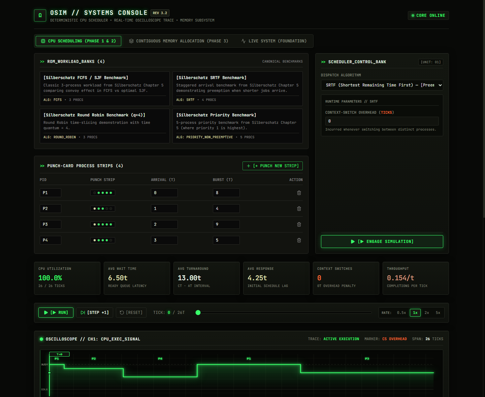
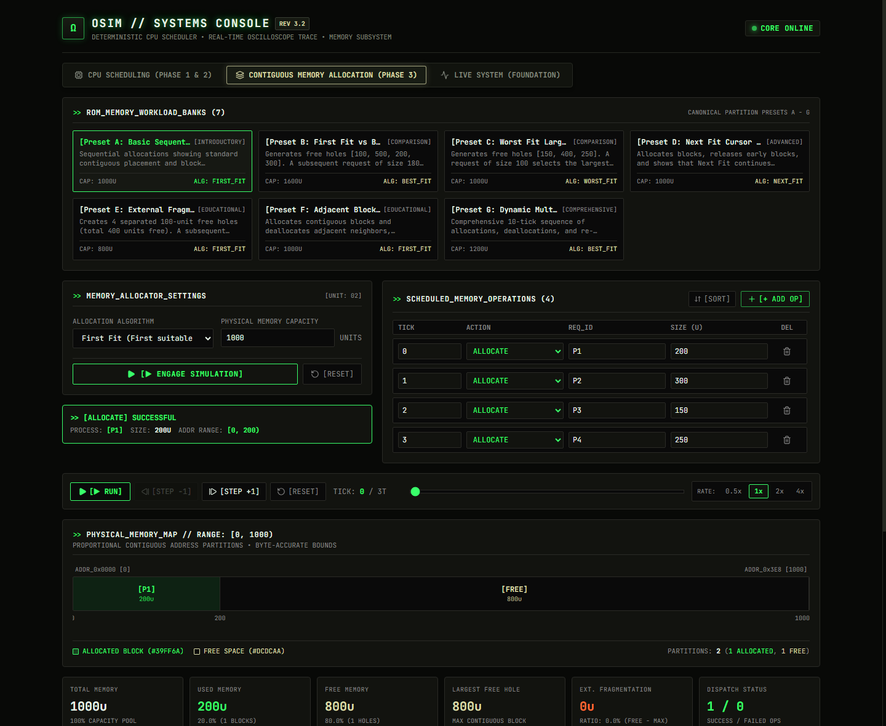

# OSim - Interactive Operating System Resource Management Simulator

## Project Overview

**OSim** is an educational, web-based operating-system simulator designed to
visualize core OS resource-management concepts interactively. Styled as a "retro
systems console" — oscilloscope-style execution traces, terminal event logs, and
punch-card process strips — it bridges the gap between theoretical operating system
principles and practical runtime behavior through real-time Gantt charts,
proportional address-accurate memory maps, process state tracking, and deterministic
timeline playback.

The simulator allows students, educators, and systems engineers to inspect
step-by-step CPU scheduling and contiguous memory allocation, simulate context
switches, examine ready queues and free holes, and analyze performance metrics
under textbook workloads and custom edge cases.

## UI Preview

| CPU Scheduling — Oscilloscope View | Memory Allocation — Address Map |
|---|---|
|  |  |

The interface renders simulation state as a live instrument panel: a stepped
oscilloscope trace for CPU execution, `[BRACKETED]` terminal-style state tags for
process transitions, a scrolling TTY event stream, and punch-card style process
input strips — all built on a strict six-color token system (phosphor green,
amber, rust, warning orange, punch-hole crimson, muted gray) against a near-black
instrument chassis.

---


## Current Implementation Status

### ✅ Phase 1 - Core Engine + CPU Scheduling
- **Discrete-Time Simulation Engine**: Deterministic tick-by-tick simulation cycle with strict temporal ordering.
- **Immutable SystemState Snapshots**: Every discrete tick produces an immutable state snapshot capturing CPU state, ready queue order, and process progress.
- **Standardized SimulationEvent Model**: Structured event stream capturing `PROCESS_ARRIVED`, `PROCESS_SCHEDULED`, `PROCESS_PREEMPTED`, `PROCESS_COMPLETED`, `CPU_IDLE`, and `CONTEXT_SWITCH`.
- **CPU Scheduling Algorithms Implemented**:
  - First-Come, First-Served (FCFS)
  - Shortest Job First (SJF, Non-Preemptive)
  - Shortest Remaining Time First (SRTF, Preemptive SJF)
  - Round Robin (RR) with configurable time quantum
  - Priority Scheduling (both Preemptive and Non-Preemptive, configurable priority polarity)
- **Deterministic Execution**: Strict tie-breaking rules guarantee identical outputs across repeated runs.
- **Comprehensive Metrics**: Automated calculation of Turnaround Time, Waiting Time, Response Time, CPU Utilization, and Throughput.
- **Context-Switch Modeling**: Configurable context-switch overhead ticks inserted between process switches.
- **Automated Tests**: 31 comprehensive unit and integration tests passing against canonical benchmarks.

### ✅ Phase 2 - CPU Scheduling API + Frontend
- **FastAPI REST API**: High-performance RESTful service exposing CPU simulation execution and benchmark workloads.
- **React + TypeScript Interface**: Modern, responsive dashboard engineered with Vite and TypeScript.
- **CPU Scheduling Controls**: Intuitive UI for selecting algorithms, adjusting quantum, toggling preemption, and configuring context-switch overhead.
- **Process Input**: Dynamic editor to add, edit, randomize, and remove processes (arrival time, burst time, priority).
- **Preset Workloads**: One-click loading of canonical Silberschatz Chapter 5 benchmarks and edge cases.
- **Gantt Chart**: Interactive, color-coded execution timeline displaying process execution bursts, idle gaps, and context-switch blocks with a live scrubber cursor.
- **Process Metrics**: Summary cards and detailed data tables with per-process completion, turnaround, waiting, and response times.
- **CPU State**: Visual card displaying the active process, remaining burst, and progress bar.
- **Ready Queue**: Real-time queue visualizer reflecting current order and arrival status.
- **Process States**: Categorized state columns tracking processes across `READY`, `RUNNING`, and `TERMINATED`.
- **Event Log**: Chronological, searchable audit trail of every simulation event with tick timestamps.
- **Timeline Playback**: Interactive media controller featuring **Play**, **Pause**, **Step Forward**, **Step Back**, **Reset**, timeline slider scrubber, and variable playback speeds (0.5x, 1x, 2x, 4x).

### ✅ Phase 3 - Contiguous Memory Allocation
- **Pure-Python Memory Engine**: Completely decoupled discrete-time memory simulation subsystem with invariant preservation.
- **Address-Accurate Contiguous Memory Model**: Single continuous address space `[0, memory_size)` using half-open intervals `[start_address, end_address)`.
- **Memory Allocation Algorithms**:
  - **First Fit**: Scans memory from address 0, selecting the first free block large enough to satisfy the request.
  - **Best Fit**: Scans all free blocks, selecting the smallest block that is large enough (tie-breaking deterministically by lowest start address).
  - **Worst Fit**: Scans all free blocks, selecting the largest available block (tie-breaking deterministically by lowest start address).
  - **Next Fit**: Scans from an integer memory address cursor forward with wrap-around back to address 0, advancing cursor to the end of the allocated partition and preserving cursor position across deallocations.
- **Dynamic Block Splitting & Canonical Coalescing**: Allocations partition free blocks cleanly into allocated and remainder blocks; deallocations trigger immediate bidirectional coalescing of adjacent free blocks.
- **Deterministic Same-Tick Ordering**: Deallocations are processed before allocations at any tick, enabling immediate reuse of freed memory within the same tick.
- **External Fragmentation Modeling**: Explicit calculation of `total_free_memory - largest_free_block`, accompanied by educational failure diagnostics explaining why contiguous allocation failed despite sufficient total free space.
- **FastAPI Endpoints**:
  - `POST /api/v1/memory/simulate`: Simulates memory operations and returns tick-by-tick snapshots, events, and metrics.
  - `GET /api/v1/memory/workloads`: Catalog of educational workloads (Presets A through G).
  - `GET /api/v1/memory/workloads/{preset_id}`: Single preset retrieval.
- **Interactive Visualization**:
  - Proportional, address-accurate memory map bar with hover tooltips and Next Fit cursor indicator.
  - Real-time KPI cards: Total, Used, Free, Largest Free Block, External Fragmentation, and Allocation Success/Failure.
  - Educational allocation feedback cards.
  - Reversible timeline playback (Play / Pause / Step Forward / Step Back / Reset / Speed / Scrubber).
  - Chronological memory event stream with type filters.

### 🔬 Live System Observation (LIVE-1 Foundation & LIVE-2 Real-Time Monitor)
- **Non-Invasive Read-Only Instrumentation**: Host system telemetry collection strictly bounded to read-only operations via Python `psutil`.
- **Pure Architectural Decoupling**: Complete AST-verified isolation between `backend/live_agent/` and `backend/sim_engine/` — `sim_engine` contains zero OS/live/psutil dependencies.
- **Immutable Domain Telemetry**: Frozen dataclasses (`ProcessObservation`, `CPUObservation`, `MemoryObservation`, `SystemSnapshot`) with strict non-negative bounds and deterministic PID ordering.
- **Robust Collector Abstraction**: Abstract collector contracts (`CPUCollector`, `MemoryCollector`, `ProcessCollector`) with ephemeral process skip semantics, honest CPU sampling intervals (no zero fabrication), and non-blocking failure surfacing.
- **FastAPI Endpoints**:
  - `GET /api/v1/live/status`: Subsystem health, availability, and host platform reporting.
  - `GET /api/v1/live/snapshot`: Explicit user-triggered point-in-time system snapshot (supports frontend polling cadence).
- **Retro Systems Console Live View (LIVE-2)**:
  - **Auto-Refresh Polling Switch**: `[ AUTO-REFRESH: PAUSED | 1s | 2s | 5s ]` with overlap protection (`inFlightRef`) and unmount timer cleanup.
  - **Discrete Rolling Sparklines**: 60-second in-memory observational buffers for CPU and RAM utilization traces (pure SVG oscilloscope style, newest samples at right, discrete genuine points).
  - **Multi-Core Load Matrix**: Grid displaying per-core utilization percentages across all logical CPU execution cores.
  - **Task Manager / htop-Style Process Table**: Dynamic text search (by Name or PID), multi-column sorting (by CPU %, RSS Memory, PID, Threads, Name), PPID inspection, and formatted CPU execution time (`CPU TIME`).
  - **Freshness & Stale Indicators**: Explicit timestamping with warning indicator on connection interruptions.
- **Architecture Documentation**: Detailed specification in [`docs/live-system-architecture.md`](docs/live-system-architecture.md).

---

## Planned Phases

> **Note on Project Sequencing**: **Phase 4 (Virtual Memory + Page Replacement)** is **intentionally paused** while the **Live System Observation Foundation** is established and verified.

- ⏸️ **Phase 4 - Virtual Memory + Page Replacement** (*Temporarily Paused*) (Paging, Page Tables, TLB simulation, FIFO, LRU, Optimal page replacement)
- ⬜ **Phase 5 - Deadlock Detection + Banker’s Algorithm** (Resource allocation graphs, cycle detection, safety algorithm, avoidance)
- ⬜ **Phase 6 - Integrated OS Simulation** (Coupled CPU, Memory, and I/O subsystem workflows)
- ⬜ **Phase 7 - Comparison / Benchmarking / Learning Mode** (Side-by-side algorithm benchmarking and interactive student quizzes)

---

## Architecture

OSim follows a strict three-tier layered architecture enforcing clean separation of concerns:

```
┌─────────────────────────────────────────────────────────┐
│                     React Frontend                      │
│        (Vite, TypeScript, Component Dashboard)          │
└───────────────────────────┬─────────────────────────────┘
                            │ HTTP / JSON
                            ▼
┌─────────────────────────────────────────────────────────┐
│                    FastAPI REST API                     │
│      (Pydantic Schemas, API Endpoints, Validation)      │
└───────────────────────────┬─────────────────────────────┘
                            │ Direct Python Invocation
                            ▼
┌─────────────────────────────────────────────────────────┐
│               Pure Python Simulation Engine             │
│    (Discrete Engine, Core Schedulers, Memory Subsystem) │
└─────────────────────────────────────────────────────────┘
```

> **Architectural Boundary Principle**: The core simulation engine (`backend/sim_engine/`) is implemented in pure Python (standard library only) and remains completely decoupled and independent from FastAPI, HTTP protocols, and any UI/web framework. It can be executed in standalone CLI scripts, automated test runners, or imported as a library.

---

## Implemented Algorithms

### CPU Scheduling
| Algorithm | Type | Preemptive | Key Parameters |
| :--- | :--- | :--- | :--- |
| **FCFS** (First-Come, First-Served) | Non-Preemptive | No | Arrival Time, Burst Time |
| **SJF** (Shortest Job First) | Non-Preemptive | No | CPU Burst Time |
| **SRTF** (Shortest Remaining Time First) | Preemptive | Yes | Remaining Burst Time |
| **Round Robin** | Preemptive | Yes | Time Quantum ($q$) |
| **Priority Scheduling** | Preemptive / Non-Preemptive | Configurable | Priority Level, Polarity |

### Contiguous Memory Allocation
| Strategy | Search Starting Point | Block Selection Criteria | Tie-Breaking Rule |
| :--- | :--- | :--- | :--- |
| **First Fit** | Address 0 | First block where $\text{size} \ge \text{requested}$ | Lowest address (scan order) |
| **Best Fit** | Address 0 (exhaustive) | Smallest block where $\text{size} \ge \text{requested}$ | Lowest start address |
| **Worst Fit** | Address 0 (exhaustive) | Largest block where $\text{size} \ge \text{requested}$ | Lowest start address |
| **Next Fit** | Current Address Cursor | First block from cursor with wrap-around | Scan order from cursor |

---

## Running the Project

### Prerequisites
- Python 3.10+
- Node.js 18+ and npm

### 1. Install Backend Dependencies
From the repository root:
```bash
pip install -r requirements.txt
```

### 2. Run the Backend API
Start the FastAPI application with Uvicorn:
```bash
uvicorn backend.app.main:app --reload --port 8000
```
- API Base URL: `http://localhost:8000`
- Interactive OpenAPI Docs: `http://localhost:8000/docs`
- Health Check: `http://localhost:8000/api/health`

### 3. Run the Frontend Application
In a separate terminal, navigate to the `frontend` directory:
```bash
cd frontend
npm install
npm run dev
```
Open your browser at the displayed local URL (typically `http://localhost:5173`). Switch seamlessly between CPU Scheduling and Contiguous Memory Allocation using the top navigation tab bar.

### 4. Run Automated Tests
Execute the full test suite (78 tests) from the repository root:
```bash
pytest
```
To run tests with verbose output:
```bash
pytest -v
```

### 5. Run the CLI Demonstration
To run the terminal-based Silberschatz benchmark suite directly through the core simulation engine:
```bash
python run_demo.py
```
This runs FCFS, SJF, SRTF, Round Robin, Priority, and context-switch overhead demonstrations with deterministic verification.
