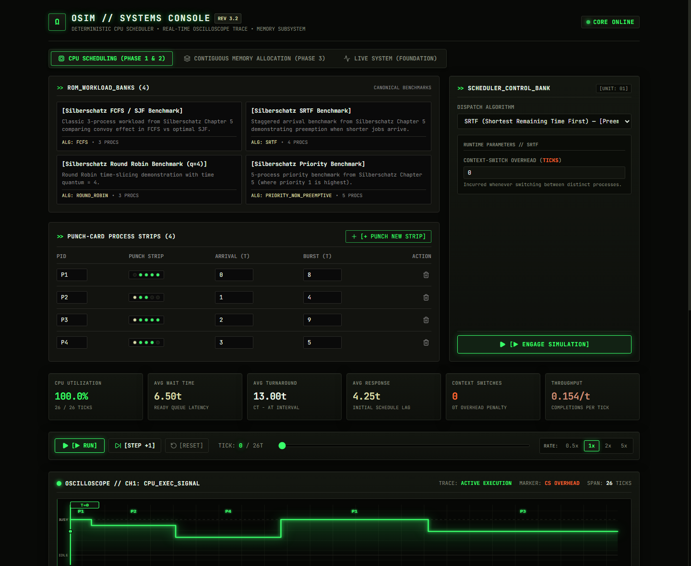
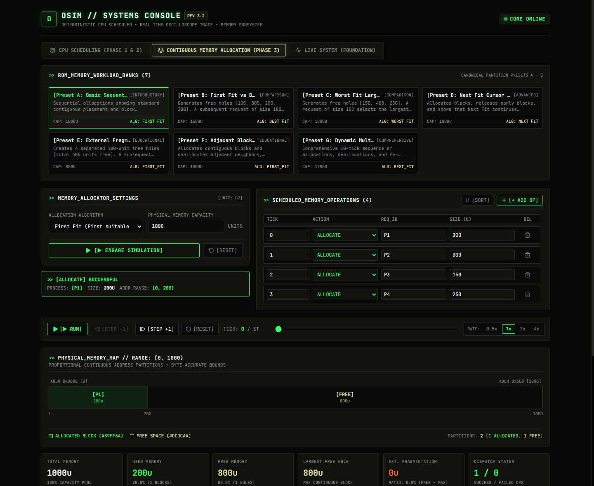
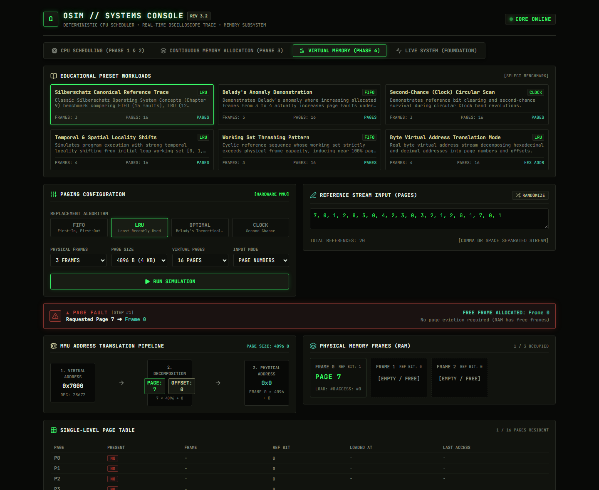
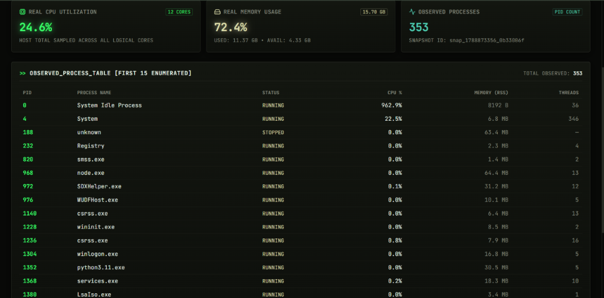

# OSim - Interactive Operating System Resource Management Simulator

## Project Overview

**OSim** is an educational, web-based operating-system simulator designed to
visualize core OS resource-management concepts interactively. Styled as a "retro
systems console" - oscilloscope-style execution traces, terminal event logs, and
punch-card process strips - it bridges the gap between theoretical operating system
principles and practical runtime behavior through real-time Gantt charts,
proportional address-accurate memory maps, MMU address-translation pipelines,
process state tracking, and deterministic timeline playback.

The simulator allows students, educators, and systems engineers to inspect
step-by-step CPU scheduling, contiguous memory allocation, and virtual memory
paging with page replacement (deterministic simulated OS resource management),
alongside non-invasive, read-only observation of real-world host operating system
processes and hardware telemetry. Users can simulate context switches, examine ready
queues, free holes, single-level page tables, and physical frame pools, and analyze
performance metrics under textbook workloads and custom edge cases.

## UI Preview

| CPU Scheduling - Oscilloscope View | Memory Allocation - Address Map | Virtual Memory - Paging & Replacement | Live System Observation - Real-Time Monitor |
|---|---|---|---|
|  |  |  |  |

The interface renders simulation state as a live instrument panel: a stepped
oscilloscope trace for CPU execution, proportional contiguous memory maps, hardware
MMU address-translation pipelines and physical frame pools, `[BRACKETED]` terminal-style
state tags for process and page transitions, a scrolling TTY event stream, real-time
discrete 60s telemetry sparklines, a multi-core execution matrix, and punch-card style
process input strips - all built on a strict six-color token system (phosphor green,
amber, rust, warning orange, punch-hole crimson, muted gray) against a near-black
instrument chassis.

---


## Current Implementation Status

### ✅ Phase 1 - Core Engine + CPU Scheduling
- **Discrete-Time Simulation Engine**: Deterministic tick-by-tick simulation cycle with strict temporal ordering.
- **Immutable SystemState Snapshots**: Every discrete tick produces an immutable state snapshot capturing CPU state, ready queue order, and process progress.
- **Standardized SimulationEvent Model**: Structured event stream capturing `PROCESS_ARRIVED`, `PROCESS_SCHEDULED`, `PROCESS_PREEMPTED`, `PROCESS_COMPLETED`, `CPU_IDLE`, and `CONTEXT_SWITCH`.
- **CPU Scheduling Algorithms Implemented**:
  - First-Come, First-Served (FCFS)
  - Shortest Job First (SJF, Non-Preemptive)
  - Shortest Remaining Time First (SRTF, Preemptive SJF)
  - Round Robin (RR) with configurable time quantum
  - Priority Scheduling (both Preemptive and Non-Preemptive, configurable priority polarity)
- **Deterministic Execution**: Strict tie-breaking rules guarantee identical outputs across repeated runs.
- **Comprehensive Metrics**: Automated calculation of Turnaround Time, Waiting Time, Response Time, CPU Utilization, and Throughput.
- **Context-Switch Modeling**: Configurable context-switch overhead ticks inserted between process switches.
- **Automated Tests**: 31 comprehensive unit and integration tests passing against canonical benchmarks.

### ✅ Phase 2 - CPU Scheduling API + Frontend
- **FastAPI REST API**: High-performance RESTful service exposing CPU simulation execution and benchmark workloads.
- **React + TypeScript Interface**: Modern, responsive dashboard engineered with Vite and TypeScript.
- **CPU Scheduling Controls**: Intuitive UI for selecting algorithms, adjusting quantum, toggling preemption, and configuring context-switch overhead.
- **Process Input**: Dynamic editor to add, edit, randomize, and remove processes (arrival time, burst time, priority).
- **Preset Workloads**: One-click loading of canonical Silberschatz Chapter 5 benchmarks and edge cases.
- **Gantt Chart**: Interactive, color-coded execution timeline displaying process execution bursts, idle gaps, and context-switch blocks with a live scrubber cursor.
- **Process Metrics**: Summary cards and detailed data tables with per-process completion, turnaround, waiting, and response times.
- **CPU State**: Visual card displaying the active process, remaining burst, and progress bar.
- **Ready Queue**: Real-time queue visualizer reflecting current order and arrival status.
- **Process States**: Categorized state columns tracking processes across `READY`, `RUNNING`, and `TERMINATED`.
- **Event Log**: Chronological, searchable audit trail of every simulation event with tick timestamps.
- **Timeline Playback**: Interactive media controller featuring **Play**, **Pause**, **Step Forward**, **Step Back**, **Reset**, timeline slider scrubber, and variable playback speeds (0.5x, 1x, 2x, 4x).

### ✅ Phase 3 - Contiguous Memory Allocation
- **Pure-Python Memory Engine**: Completely decoupled discrete-time memory simulation subsystem with invariant preservation.
- **Address-Accurate Contiguous Memory Model**: Single continuous address space `[0, memory_size)` using half-open intervals `[start_address, end_address)`.
- **Memory Allocation Algorithms**:
  - **First Fit**: Scans memory from address 0, selecting the first free block large enough to satisfy the request.
  - **Best Fit**: Scans all free blocks, selecting the smallest block that is large enough (tie-breaking deterministically by lowest start address).
  - **Worst Fit**: Scans all free blocks, selecting the largest available block (tie-breaking deterministically by lowest start address).
  - **Next Fit**: Scans from an integer memory address cursor forward with wrap-around back to address 0, advancing cursor to the end of the allocated partition and preserving cursor position across deallocations.
- **Dynamic Block Splitting & Canonical Coalescing**: Allocations partition free blocks cleanly into allocated and remainder blocks; deallocations trigger immediate bidirectional coalescing of adjacent free blocks.
- **Deterministic Same-Tick Ordering**: Deallocations are processed before allocations at any tick, enabling immediate reuse of freed memory within the same tick.
- **External Fragmentation Modeling**: Explicit calculation of `total_free_memory - largest_free_block`, accompanied by educational failure diagnostics explaining why contiguous allocation failed despite sufficient total free space.
- **FastAPI Endpoints**:
  - `POST /api/v1/memory/simulate`: Simulates memory operations and returns tick-by-tick snapshots, events, and metrics.
  - `GET /api/v1/memory/workloads`: Catalog of educational workloads (Presets A through G).
  - `GET /api/v1/memory/workloads/{preset_id}`: Single preset retrieval.
- **Interactive Visualization**:
  - Proportional, address-accurate memory map bar with hover tooltips and Next Fit cursor indicator.
  - Real-time KPI cards: Total, Used, Free, Largest Free Block, External Fragmentation, and Allocation Success/Failure.
  - Educational allocation feedback cards.
  - Reversible timeline playback (Play / Pause / Step Forward / Step Back / Reset / Speed / Scrubber).
  - Chronological memory event stream with type filters.

### 🔬 Live System Observation (LIVE-1 Foundation & LIVE-2 Real-Time Monitor)
- **Non-Invasive Read-Only Instrumentation**: Host system telemetry collection strictly bounded to read-only operations via Python `psutil`.
- **Pure Architectural Decoupling**: Complete AST-verified isolation between `backend/live_agent/` and `backend/sim_engine/` — `sim_engine` contains zero OS/live/psutil dependencies.
- **Immutable Domain Telemetry**: Frozen dataclasses (`ProcessObservation`, `CPUObservation`, `MemoryObservation`, `SystemSnapshot`) with strict non-negative bounds and deterministic PID ordering.
- **Robust Collector Abstraction**: Abstract collector contracts (`CPUCollector`, `MemoryCollector`, `ProcessCollector`) with ephemeral process skip semantics, honest CPU sampling intervals (no zero fabrication), and non-blocking failure surfacing.
- **FastAPI Endpoints**:
  - `GET /api/v1/live/status`: Subsystem health, availability, and host platform reporting.
  - `GET /api/v1/live/snapshot`: Explicit user-triggered point-in-time system snapshot (supports frontend polling cadence).
- **Retro Systems Console Live View (LIVE-2)**:
  - **Auto-Refresh Polling Switch**: `[ AUTO-REFRESH: PAUSED | 1s | 2s | 5s ]` with overlap protection (`inFlightRef`) and unmount timer cleanup.
  - **Discrete Rolling Sparklines**: 60-second in-memory observational buffers for CPU and RAM utilization traces (pure SVG oscilloscope style, newest samples at right, discrete genuine points).
  - **Multi-Core Load Matrix**: Grid displaying per-core utilization percentages across all logical CPU execution cores.
  - **Task Manager / htop-Style Process Table**: Dynamic text search (by Name or PID), multi-column sorting (by CPU %, RSS Memory, PID, Threads, Name), PPID inspection, and formatted CPU execution time (`CPU TIME`).
  - **Freshness & Stale Indicators**: Explicit timestamping with warning indicator on connection interruptions.
- **Architecture Documentation**: Detailed specification in [`docs/live-system-architecture.md`](docs/live-system-architecture.md).

### ✅ Phase 4 - Virtual Memory + Page Replacement
- **Pure-Python Virtual Memory Engine**: Completely decoupled discrete-time paging simulation subsystem with strict invariant preservation.
- **Mathematical Address Decomposition**: Power-of-two virtual address spaces decomposing byte addresses into virtual page number ($\lfloor \text{addr} / S \rfloor$) and offset ($\text{addr} \pmod S$).
- **Single-Level Page Table**: Strict single-level page mapping tracking page residency with explicit `is_present: bool` semantics (distinguishing resident pages from valid addresses).
- **Physical Memory Pool**: Indexed RAM hardware frame management with deterministic free-frame allocation before page replacement.
- **Page Replacement Policies**:
  - **FIFO**: First-In, First-Out replacement evicting the longest resident page (exhibits classic Belady's anomaly).
  - **LRU**: Least Recently Used replacement evicting the least recently accessed page (stack algorithm, immune to Belady's anomaly).
  - **Optimal (Belady's MIN)**: Theoretical offline benchmark inspecting remaining reference sequence to evict pages not used for the longest time or never used again.
  - **Second-Chance (Clock)**: Hardware approximation of LRU with persistent circular clock hand and reference-bit clearing across scan revolutions.
- **Dual Input Modes**:
  - **Page References**: Stream of abstract page numbers with zero offset (e.g. `[7, 0, 1, 2, 0, 3...]`).
  - **Byte Virtual Addresses**: Stream of decimal or hexadecimal byte addresses decomposed into page numbers and offsets (e.g. `[0x0, 0x1000, 0x1388...]`).
- **Comprehensive Paging Metrics**: Page hits, page faults, hit ratio, fault ratio, replacements, evictions, and free frame counts.
- **FastAPI Endpoints**:
  - `POST /api/v1/virtual-memory/simulate`: Simulates paging and returns tick-by-tick immutable snapshots, events, and metrics.
  - `GET /api/v1/virtual-memory/workloads`: Educational benchmark presets (Silberschatz, Belady's anomaly, Clock scan, Locality, Thrashing).
  - `GET /api/v1/virtual-memory/workloads/{preset_id}`: Single preset retrieval.
- **Systems Console UI**:
  - MMU address translation pipeline visualizer (Virtual Address $\to$ Page/Offset $\to$ Physical Address).
  - High-visibility `[PAGE HIT]` (phosphor green) vs `[PAGE FAULT]` (crimson) oscilloscope banner.
  - Physical RAM hardware frame cards with occupancy, load/access timestamps, and animated `[CLOCK HAND ➜]` badge.
  - Tabular Single-Level Page Table with presence indicators and reference bits.
  - Reversible timeline playback (Play / Pause / Step Forward / Step Back / Reset / Speed / Scrubber).
  - Detailed technical documentation in [`docs/phase-4-report.md`](docs/phase-4-report.md).

### ✅ Phase 5 - Deadlock Detection + Banker's Algorithm
- **Pure-Python Deadlock Subsystem**: Decoupled domain engine modeling processes ($n$), resource types ($m$), multiple instances, and matrix invariants ($Alloc$, $Max$, $Need$, $Request$, $Total$, $Available$).
- **Strict Invariant Verification**: Mathematical enforcement of conservation of instances ($\sum Alloc_j + A_j = E_j$), claim upper bounds ($Alloc \le Max$), non-negativity, and auto-computed $Need = Max - Alloc$.
- **Banker's Safety Algorithm**: Deterministic $O(m \times n^2)$ safety algorithm finding safe execution sequences with lowest process index tie-breaking.
- **Resource Request Evaluator**: Dynamic evaluation of process resource requests supporting:
  - `GRANTED`: $Request \le Need$, $Request \le Available$, tentative state is SAFE.
  - `WAITING`: $Request \le Need$, but $Request > Available$ (insufficient resources; no state change).
  - `DENIED`: $Request \le Available$, but tentative state is UNSAFE (triggers complete structural rollback).
  - `ERROR`: Claim exceeded ($Request > Need$) or invalid process/dimension.
- **Deadlock Detection Engine**: Reactive Coffman/Silberschatz multi-instance row reduction using the actual $Request$ matrix (strictly distinct from $Need$).
- **Graph Visualizations**:
  - **Resource Allocation Graph (RAG)**: Bipartite directed graph showing processes, resource capacities, assignment edges ($R \to P$), and request edges ($P \to R$).
  - **Wait-For Graph (WFG)**: Reduced directed graph for single-instance resource systems ($P_i \to P_k$).
  - **Single vs Multi-Instance Cycle Semantics**: Communicates that single-instance cycle implies deadlock, whereas multi-instance cycle alone does not prove deadlock.
- **Verified Educational Presets**:
  1. *Classic Banker Safe State* (Silberschatz Ch. 7, safe sequence $\langle P_1, P_3, P_0, P_2, P_4 \rangle$).
  2. *Granted Resource Request* ($P_1$ requests $[1, 0, 2] \implies$ GRANTED).
  3. *Unsafe Request Denial* ($P_0$ requests $[0, 2, 0] \implies$ DENIED and rolled back).
  4. *Single-Instance Circular Deadlock* (4-process ring $\implies$ DEADLOCKED).
  5. *Multi-Instance Cycle with NO Deadlock* (Counterexample proving RAG cycle alone does not imply deadlock).
  6. *Genuine Multi-Instance Deadlock* (Silberschatz 7.6.2 benchmark $\implies$ deadlocked set $\{P_1, P_2, P_3, P_4\}$).
- **FastAPI Endpoints**:
  - `POST /api/v1/deadlock/safety`: Banker's safety check and safe sequence generation.
  - `POST /api/v1/deadlock/request`: Resource request evaluation with tentative allocation and rollback.
  - `POST /api/v1/deadlock/detect`: Multi-instance matrix reduction detection.
  - `GET /api/v1/deadlock/workloads`: Educational preset catalog.
  - `GET /api/v1/deadlock/workloads/{preset_id}`: Preset scenario retrieval.
- **Systems Console UI**:
  - Matrix view ($Alloc$, $Max$, $Need$, $Request$, $Total$, $Available$).
  - Work progression tracker, Finish array flags, and safe sequence badge.
  - Interactive resource request form with instant outcome feedback.
  - Interactive SVG RAG & WFG renderer with cycle highlighting.
  - Reversible timeline playback and deterministic event log stream.
  - Detailed technical report in [`docs/phase-5-report.md`](docs/phase-5-report.md).

---

## Planned Phases

- ⬜ **Phase 6 - Integrated OS Simulation** (Coupled CPU, Memory, and I/O subsystem workflows)
- ⬜ **Phase 7 - Comparison / Benchmarking / Learning Mode** (Side-by-side algorithm benchmarking and interactive student quizzes)

---

## Architecture

OSim enforces a decoupled architecture with strict separation of concerns between theoretical simulation and real-world system observation:

```
┌────────────────────────────────────────────────────────────────────────┐
│                             React Frontend                             │
│       (Vite, TypeScript, Retro Systems Console Dashboard)              │
│       • CPU Scheduling (Phase 1 & 2)                                   │
│       • Contiguous Memory Allocation (Phase 3)                         │
│       • Virtual Memory / Paging (Phase 4)                              │
│       • Deadlock Detection & Banker's Algorithm (Phase 5)              │
│       • Live System Observation (LIVE-1 Foundation & LIVE-2 Monitor)   │
└───────────────────────────────────┬────────────────────────────────────┘
                                    │ HTTP / JSON
                                    ▼
┌────────────────────────────────────────────────────────────────────────┐
│                            FastAPI REST API                            │
│                 (Pydantic Schemas, Endpoints, Validation)              │
└──────────────────┬─────────────────────────────────┬───────────────────┘
                   │ Direct Python Invocation        │ Direct Python Invocation
                   ▼                                 ▼
┌─────────────────────────────────────┐ ┌────────────────────────────────┐
│    Pure Python Simulation Engine    │ │     Live System Observation    │
│       (backend/sim_engine/)         │ │      (backend/live_agent/)     │
│                                     │ │                                │
│ • Standard library only             │ │ • Non-invasive read-only       │
│ • Deterministic discrete ticks      │ │ • psutil host inspection       │
│ • CPU schedulers & memory models    │ │ • Real CPU, RAM, & processes   │
│ • Virtual memory / page replacement │ │ • Zero command/kill privileges │
│ • Deadlock detection & Banker's     │ │                                │
│ • ZERO OS/live/network dependencies │ │                                │
└─────────────────────────────────────┘ └────────────────────────────────┘
```

> **Architectural Boundary Principle**: The core simulation engine (`backend/sim_engine/`) is implemented in pure Python (standard library only) and remains completely decoupled and independent from FastAPI, HTTP protocols, `psutil`, and any UI/web framework. An automated AST test (`backend/tests/test_architecture_boundaries.py`) enforces that `sim_engine` contains **zero imports** of `live_agent`, `psutil`, `fastapi`, `starlette`, or OS observation APIs.

---

## Implemented Algorithms

### CPU Scheduling
| Algorithm | Type | Preemptive | Key Parameters |
| :--- | :--- | :--- | :--- |
| **FCFS** (First-Come, First-Served) | Non-Preemptive | No | Arrival Time, Burst Time |
| **SJF** (Shortest Job First) | Non-Preemptive | No | CPU Burst Time |
| **SRTF** (Shortest Remaining Time First) | Preemptive | Yes | Remaining Burst Time |
| **Round Robin** | Preemptive | Yes | Time Quantum ($q$) |
| **Priority Scheduling** | Preemptive / Non-Preemptive | Configurable | Priority Level, Polarity |

### Contiguous Memory Allocation
| Strategy | Search Starting Point | Block Selection Criteria | Tie-Breaking Rule |
| :--- | :--- | :--- | :--- |
| **First Fit** | Address 0 | First block where $\text{size} \ge \text{requested}$ | Lowest address (scan order) |
| **Best Fit** | Address 0 (exhaustive) | Smallest block where $\text{size} \ge \text{requested}$ | Lowest start address |
| **Worst Fit** | Address 0 (exhaustive) | Largest block where $\text{size} \ge \text{requested}$ | Lowest start address |
| **Next Fit** | Current Address Cursor | First block from cursor with wrap-around | Scan order from cursor |

### Virtual Memory & Page Replacement
| Policy | Type | Eviction Criteria | Tie-Breaking / State |
| :--- | :--- | :--- | :--- |
| **FIFO** (First-In, First-Out) | Online | Longest resident page (`loaded_at_tick`) | Deterministic insertion order |
| **LRU** (Least Recently Used) | Online | Least recently accessed page (`last_accessed_tick`) | Lowest frame index |
| **Optimal** (Belady's MIN) | Offline Benchmark | Page never used again, or farthest next future reference | Lowest frame index |
| **Clock** (Second-Chance) | Online | First page with `reference_bit == 0` along circular scan | Persistent `clock_hand` pointer |

### Deadlock Avoidance & Detection
| Algorithm | Classification | Demand Input | Output / Guarantees |
| :--- | :--- | :--- | :--- |
| **Banker's Safety Algorithm** | Avoidance | $Need = Max - Alloc$ | Safe sequence $\langle P_i, \dots \rangle$ or UNSAFE |
| **Resource Request Evaluator** | Avoidance | Process $Request$ Vector | Tentative safety test $\implies$ GRANTED, WAITING, or DENIED (rollback) |
| **Multi-Instance Matrix Reduction** | Detection | $Request$ Matrix | Reduced set or DEADLOCK DETECTED with deadlocked processes |
| **WFG Cycle Detection** | Detection | Single-Instance Wait-For Graph | 3-Color DFS cycle detection ($\text{Cycle} \iff \text{Deadlock}$) |

---

## Running the Project

### Prerequisites
- Python 3.10+
- Node.js 18+ and npm

### 1. Install Backend Dependencies
From the repository root:
```bash
pip install -r requirements.txt
```

### 2. Run the Backend API
Start the FastAPI application with Uvicorn:
```bash
uvicorn backend.app.main:app --reload --port 8000
```
- API Base URL: `http://localhost:8000`
- Interactive OpenAPI Docs: `http://localhost:8000/docs`
- Health Check: `http://localhost:8000/api/health`

#### REST API Reference
| Endpoint | Method | Subsystem | Description |
| :--- | :--- | :--- | :--- |
| `/api/health` | `GET` | Core | Backend health status |
| `/api/v1/cpu/simulate` | `POST` | CPU Simulation | Run deterministic CPU scheduling simulation |
| `/api/v1/cpu/presets` | `GET` | CPU Simulation | Retrieve canonical Silberschatz Chapter 5 benchmark workloads |
| `/api/v1/memory/simulate` | `POST` | Memory Simulation | Run discrete-time contiguous memory allocation simulation |
| `/api/v1/memory/workloads` | `GET` | Memory Simulation | Retrieve catalog of educational contiguous memory presets |
| `/api/v1/memory/workloads/{preset_id}` | `GET` | Memory Simulation | Retrieve a specific memory workload preset |
| `/api/v1/virtual-memory/simulate` | `POST` | Virtual Memory | Run deterministic virtual-memory paging/page-replacement simulation |
| `/api/v1/virtual-memory/workloads` | `GET` | Virtual Memory | Retrieve educational virtual-memory workload presets |
| `/api/v1/virtual-memory/workloads/{preset_id}` | `GET` | Virtual Memory | Retrieve one virtual-memory preset |
| `/api/v1/deadlock/safety` | `POST` | Deadlock / Banker | Evaluate Banker's safety algorithm and find safe sequence |
| `/api/v1/deadlock/request` | `POST` | Deadlock / Banker | Evaluate specific process resource request under avoidance |
| `/api/v1/deadlock/detect` | `POST` | Deadlock / Banker | Run Coffman multi-instance matrix reduction detection |
| `/api/v1/deadlock/workloads` | `GET` | Deadlock / Banker | Retrieve educational deadlock & Banker presets catalog |
| `/api/v1/deadlock/workloads/{preset_id}` | `GET` | Deadlock / Banker | Retrieve a specific deadlock preset |
| `/api/v1/live/status` | `GET` | Live Observation | Check host observation collector availability and platform |
| `/api/v1/live/snapshot` | `GET` | Live Observation | Capture point-in-time real host CPU, memory, and process telemetry |

### 3. Run the Frontend Application
In a separate terminal, navigate to the `frontend` directory:
```bash
cd frontend
npm install
npm run dev
```
Open your browser at the displayed local URL (typically `http://localhost:5173`). Switch seamlessly between:
- **CPU SCHEDULING (PHASE 1 & 2)**: Oscilloscope Gantt trace, state cards, ready queue, Silberschatz presets, timeline scrubber.
- **CONTIGUOUS MEMORY ALLOCATION (PHASE 3)**: Address-accurate proportional memory map, dynamic free/allocated holes, Next Fit cursor, external fragmentation diagnostics.
- **VIRTUAL MEMORY (PHASE 4)**: MMU/address translation visualization, single-level page table (`is_present` residency), physical frame pool with Clock hand indicator, page faults/hits, FIFO/LRU/Optimal/Clock policies, and reversible timeline playback.
- **DEADLOCK / BANKER'S (PHASE 5)**: Matrix view ($Alloc, Max, Need, Request$), Banker's safe sequence visualizer, interactive resource request evaluator (Granted / Waiting / Denied / Rollback), bipartite RAG & single-instance WFG visualizer with cycle highlights.
- **LIVE SYSTEM (FOUNDATION & REAL-TIME)**: Non-invasive host observation, real-time auto-refresh polling (1s / 2s / 5s / Paused), 60s discrete telemetry sparklines, per-core matrix, and sortable/searchable process table.

### 4. Run Automated Tests & Validation
Execute the full test suite from the repository root (current verified baseline: **160 passed**):
```bash
pytest
```
To run tests with concise or verbose output:
```bash
python -m pytest -q
pytest -v
```
To verify that the simulation engine remains strictly decoupled from host/OS/web libraries (AST boundary test):
```bash
pytest backend/tests/test_architecture_boundaries.py -v
```
To validate the frontend TypeScript build and linter (current verified baseline: **0 errors**):
```bash
cd frontend
npm run build
npm run lint
```

### 5. Run the CLI Demonstration
To run the terminal-based Silberschatz benchmark suite directly through the core simulation engine:
```bash
python run_demo.py
```
This runs FCFS, SJF, SRTF, Round Robin, Priority, and context-switch overhead demonstrations with deterministic verification.

